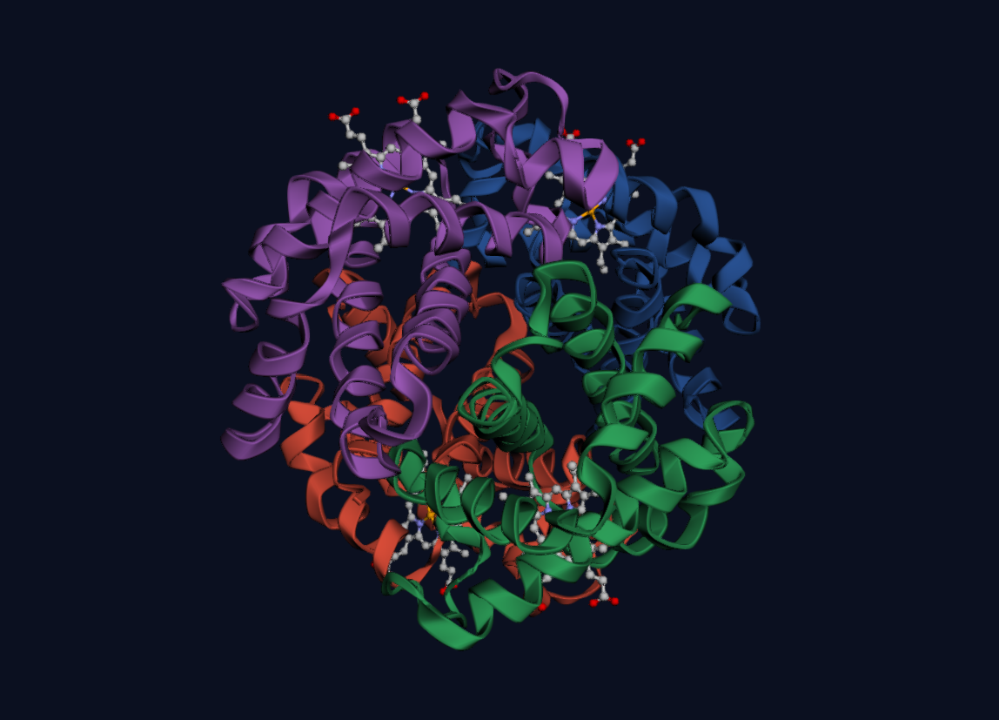
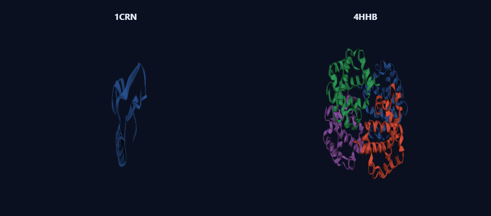

# PEKI Fold

*Protein Exploration Kit for Insights*

Ferramentas de **análise estrutural de proteínas** (formato PDB) desenvolvidas
como Trabalho Final da disciplina de Algoritmos (Doutorado — UFJ), com uma
**aplicação web** que torna as análises visuais e acessíveis pelo navegador.

🔬 **App online:** https://allisonbraz.github.io/PEKI-Fold/ — publicado via GitHub Pages a partir da pasta [`docs/`](docs/).
Exemplos diretos: [1A00](https://allisonbraz.github.io/PEKI-Fold/?pdb=1A00) · [comparar 1CRN e 4HHB](https://allisonbraz.github.io/PEKI-Fold/?compare=1CRN,4HHB).



*Visualização 3D da hemoglobina (1A00) colorida por cadeia, com os grupos HEM em destaque.*



*Modo de comparação: estruturas lado a lado (crambina 1CRN e hemoglobina 4HHB).*

## Funcionalidades

| # | Análise | CLI (Python) | Web |
|---|---|---|---|
| 01/02 | Separação de cadeias | `programa01.py` / `programa02.py` + `separador.py` | ✅ |
| 03 | Estatísticas estruturais (átomos, resíduos, aminoácidos) | `programa03.py` | ✅ |
| 04 | Frequência de aminoácidos + gráficos | `programa04.py` | ✅ |
| 05 | Busca de motivos estruturais | `programa05.py` | ✅ |
| 06 | Detecção de pockets (DoGSite3) | `programa06.py` | ✅ (via API ProteinsPlus) |

## Estrutura do repositório

```
.
├── docs/             # App web estático (GitHub Pages) — análise no navegador
├── pdbproteins/      # Estruturas PDB de entrada (exemplos)
├── programa01..06.py # Programas da atividade (CLI)
├── separador.py      # Módulo de separação de cadeias
├── gerar_relatorio.py# Gera o Relatorio_Final.pdf
├── Relatorio_Final.pdf
└── PRD.md            # Documento de requisitos do produto (roadmap)
```

> As pastas `chainsproteins/`, `graphs/` e `resultados_dogsite/` são **geradas**
> ao executar os programas e por isso não são versionadas.

## App web (recomendado)

Aplicação **100% no navegador** — sem servidor, sem instalação, sem limite de
upload. Cole um ID do PDB (ex.: `1A00`) ou envie um `.pdb`, veja a estrutura em
3D e explore cadeias, estatísticas, frequência de aminoácidos, motivos e
**pockets**. A detecção de pockets usa a API oficial do **DoGSiteScorer**
(ProteinsPlus/ZBH) chamada direto do navegador — só requer um ID do PDB.

Também é possível **comparar de 2 a 4 proteínas** lado a lado (estatísticas,
aminoácidos e pockets cross-protein, com as 5 perguntas do trabalho respondidas
entre as proteínas).

Testar localmente:
```bash
cd docs
python -m http.server 8080   # abre http://localhost:8080
```

Detalhes e instruções de publicação: [`docs/README.md`](docs/README.md).

## Programas em Python (CLI)

Requer Python 3 (e `pandas`, `matplotlib`, `reportlab` para os programas 03–06 e
o relatório). Execução típica:
```bash
python programa01.py          # separa as cadeias em chainsproteins/
python programa03.py          # estatísticas
python programa04.py          # frequência + gráficos em graphs/
python programa05.py GLY-LYS-SER
python gerar_relatorio.py     # gera Relatorio_Final.pdf
```

## Tecnologias

- **Web:** HTML/CSS/JS estático (sem backend), [3Dmol.js](https://3dmol.csb.pitt.edu/) (viewer 3D),
  [Plotly](https://plotly.com/javascript/) (gráficos) e [jsPDF](https://github.com/parallax/jsPDF)
  (exportação), via CDN.
- **CLI:** Python (pandas, matplotlib, reportlab).
- **Dados:** estruturas e metadados do [RCSB PDB](https://www.rcsb.org/);
  pockets via [DoGSiteScorer/ProteinsPlus](https://proteins.plus/).

## Autoria

Desenvolvido por **Allison Braz** na **Universidade Federal de Jataí (UFJ)**,
sob orientação do **Prof. Dr. Roosevelt Alves da Silva**, como Trabalho Final da
disciplina de Algoritmos (Doutorado).

## Licença / créditos

Projeto acadêmico. Detecção de pockets baseada no DoGSite3 (ZBH, Universidade de
Hamburgo) — ver `PRD.md` para o plano de integração.
